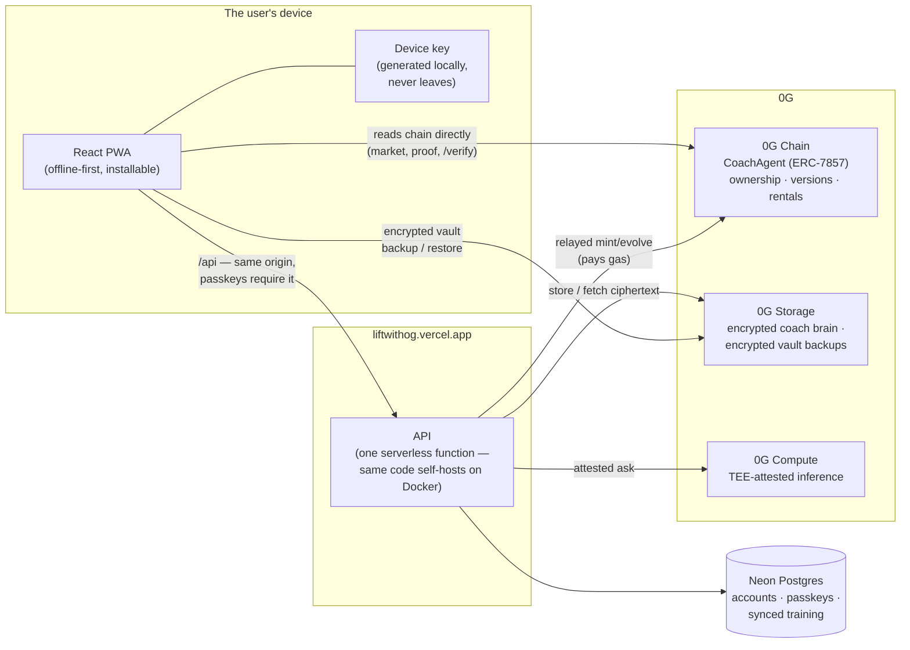
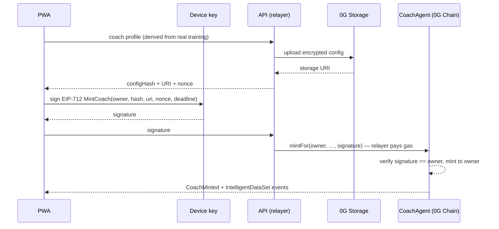
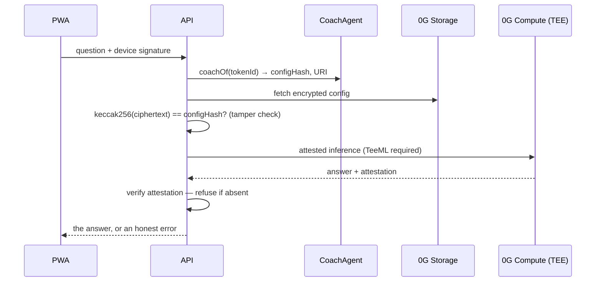

# Architecture

LIFTWITHOG is a workout and nutrition tracker whose AI coach is **property**:
an ERC-7857 Agentic ID on 0G Chain that the user's own device controls, whose
encrypted brain lives on 0G Storage, and whose advice runs inside a
TEE-attested enclave on 0G Compute. Delete this app, and the coach — its
identity, its learning history, its rental income — is still there.

This document explains every component, why it exists, and exactly where 0G
sits. Everything described here is in this repository and checkable; the
companion [VERIFICATION.md](VERIFICATION.md) gives the command or explorer
link for each claim.

---

## The system at a glance

Two properties of this shape are load-bearing:

1. **The browser reads 0G Chain itself.** The coach market, the Proof screen
   and the public [/verify](https://liftwithog.vercel.app/#/verify) page query
   the public RPC from the visitor's device. Nothing we serve can fake what
   the chain says.
2. **Everything arrives on one origin.** Passkeys are bound to a hostname, so
   the API is reached at `/api` on the same domain — as a Vercel function in
   the hosted deployment, behind nginx in the self-hosted one.

---

## Why this stack, honestly

**Why AI at all.** A tracker records; a coach decides. Progression targets,
deload timing, plate math, warm-up ramps and nutrition targets are all
decisions people get wrong alone. The deterministic parts are deterministic
code (and mutation-tested); the judgment parts are the coach.

**Why the AI must be private.** Training and body data is health data. The
coach answers **only** from a TEE-attested enclave on 0G Compute — the
attestation is checked per response, and if no attested provider is live the
product refuses rather than quietly falling back to an unattested one
(`server/coach-runtime.js`). Privacy here is a checked property, not a
setting.

**Why a blockchain.** Because the coach is worth owning. Its knowledge
compounds for years — that history should not be a row in our database that
disappears with our company. On chain it is property: transferable, rentable,
verifiable, and older than any app that reads it.

**Why 0G specifically — with the arithmetic, because the claim is falsifiable.**

The architecture's bet is that the coach evolves after **every** workout. That
one decision is what makes the version count mean something, and it is also
what makes the cost question decisive: an evolve is a storage write plus a
chain transaction, and somebody training four times a week does ~200 of them a
year.

Measured on 0G Galileo from this project's own relayer wallet:

| | measured |
|---|---|
| gas per mint | ~296,000 |
| gas per evolve | ~244,000–293,000 |
| fee per relayed transaction | **~0.00099 0G** (average of four real transactions) |
| a year of training (200 evolves) | **~0.2 0G** |

Two hundred evolves a year, per athlete, for a fraction of a token. That is
the number the whole design rests on, and it is why the flywheel can be
automatic rather than a button somebody presses when they feel it is worth
paying for.

**"Couldn't this be Ethereum + IPFS + a TEE cloud?"** Technically yes, and it
would be a different product:

- **The chain.** At Ethereum L1 gas prices, 250,000 gas per evolve is dollars,
  not fractions of a cent — so evolving on every workout is impossible and the
  design collapses into "evolve occasionally, when it seems worth it". A
  version count that only increments when the user can afford it stops being a
  record of training.
- **The storage.** IPFS pins what somebody keeps paying to pin. The coach's
  premise is that it outlives this company; a brain that disappears when our
  pinning service lapses is not property.
- **The compute.** A TEE from a cloud vendor is *their* attestation about
  *their* enclave, verified against *their* endpoint. 0G Compute publishes
  attested providers as a marketplace the browser can enumerate and the
  contract can be pointed at — the difference between "trust our vendor" and
  "check the provider yourself", which is the entire privacy claim.
- **And the joins.** Those three would be three vendors, three accounts, three
  billing relationships and no shared identity. On 0G the same key that owns
  the agent pays for its storage and its inference, which is what makes *an
  agent that owns its own mind* a thing you can build rather than a diagram
  with integration work hidden in the arrows.

**What we would need for that argument to fail:** an L2 with 0G-comparable fees
plus permanent storage plus an enumerable attested-compute market under one
account model. If that arrives, this architecture ports — the storage and
compute layers are already behind interfaces. Until it does, the per-evolve
arithmetic above is the answer.

---

## The 0G integration, component by component

### 0G Chain — the coach is property

[`contracts/src/CoachAgent.sol`](contracts/src/CoachAgent.sol) — a genuine
**ERC-7857 Agentic ID** (interfaces vendored verbatim from 0G's
`agenticID-examples`) that is also an ERC-721:

| On chain | Meaning |
|---|---|
| `IntelligentData { description, dataHash }` | keccak256 of the encrypted brain + its 0G Storage URI |
| `version`, `updatedAt` | how much this coach has learned, and when — climbs on every evolve |
| `authorizeUsage / revokeAuthorization` | open-ended executor grants (7857) |
| `rent()` | paid, **expiring** access: payment reaches the trainer in the same transaction that grants it |
| epoch counter | a sale voids every grant in **constant gas** — a coach with a thousand renters must never become impossible to sell |
| `iTransferFrom` + immutable verifier | transfer with re-encryption proof; deployed verifier-less it **refuses rather than pretends** |

Design positions worth naming: the contract holds no funds and has no
withdraw, owner, admin, pause or upgrade path. Nobody — including us — can
freeze or reassign a coach.

### Gasless ownership — EIP-712 + relayer

Nobody installs a wallet to get a coach. The app generates a key on the
device (BIP-39, stored locally, never transmitted); it signs typed
`MintCoach` / `EvolveCoach` messages; the server's relayer submits and pays.
The signature names the owner, so the relayer **cannot redirect ownership** —
it can only pay. The owning address holds 0.0 tokens and still owns the coach;
the Proof screen shows that balance live because it is the point.

### 0G Compute — inference that proves where it ran

`server/coach-runtime.js` selects a provider from the 0G Compute marketplace,
**requires** TEE attestation (`TeeML`), sends the coach's context, and
verifies the response's attestation before the app will show it. Fail-closed:
no attested provider → an honest error, never a silent downgrade.

### 0G Storage — the brain and the vault

Two distinct uses:

- **The coach's brain**: its profile is encrypted on the server, uploaded to
  0G Storage, and the chain records only `(dataHash, URI)`. On every ask, the
  stored config is fetched and its keccak256 checked against the chain —
  a tampered brain is detected, not trusted (`config_tampered` path).
- **The user's vault**: full training history, AES-256-GCM encrypted **on the
  device** with a key derived from a signature, pushed to 0G Storage. Restore
  needs the root hash and the key; 0G holds ciphertext only.

### Payments — on chain, atomically

`rent()` is checks-effects-interactions with the payout as the final call:
access and payment are one atomic fact. The invariant suite drives random
call sequences and asserts the contract balance is **always zero** — there is
no custody, and no fee skim, by construction. The relayer's gas spend is the
product's only operating payment, visible on the explorer.

### What we do not use, and why

**0G DA** is built for high-throughput rollup-style data availability. This
product has no such stream, and wiring it in anyway would be exactly the
decorative integration the 0G brief warns against. If coach telemetry ever
becomes high-frequency, DA is where it would go — it is not there today,
so we do not claim it.

---

## The flows that matter

### Minting a coach (no wallet, no gas, still yours)

### The flywheel — evolving after every workout

Finishing a workout re-derives the coach profile from actual training,
re-encrypts, re-uploads, and submits a signed `evolve` **in the background** —
deliberately not awaited, so a slow chain can never make a finished workout
feel unfinished. The on-chain `version` climbing is the public record that
this coach has genuinely learned; the Proof screen reads it live.

### Asking the coach

### Renting a trainer's coach

Browser → chain directly: `rent{value}(tokenId, days)` grants expiring access
and forwards the entire payment to the trainer in the same transaction.
Renewals extend from the current expiry (never stealing paid days); a sale
bumps the epoch and voids every grant. All three properties are fuzz-tested.

---

## Data and trust model

| Data | Lives | Encrypted | Who can read it |
|---|---|---|---|
| Device key / recovery phrase | the device, per profile | at rest by the platform | the device only |
| Training & nutrition state | device + Neon (synced) | TLS in transit | the user; the operator of their instance |
| Accounts & passkey credentials | Neon (or `data/` self-hosted) | — (public-key material) | instance operator |
| Coach brain | 0G Storage | server-side, hash-anchored on chain | holders of the coach service key |
| Vault backups | 0G Storage | **device-side AES-256-GCM** | key-holder only — not us, not 0G |
| Ownership, versions, rentals | 0G Chain | public by design | everyone — that is the point |
| Session cookies | HMAC-signed | — | forgeable only with the instance secret; a once-leaked key is auto-rotated by hash at boot |

The two keys with different bosses: the **device key** (the user's — never
leaves the device) and the **relayer key** (ours — only ever pays gas, can
redirect nothing).

---

## Deployment topologies

**Hosted (live):** static PWA + one serverless function on Vercel, state in
Neon Postgres, 0G reached from both the browser and the function.
The server is stateless — `server/store.js` selects Postgres whenever
`DATABASE_URL` is set.

**Self-hosted (sovereignty):** `docker compose up` — nginx serves the PWA and
proxies `/api` to the same server code running long-lived with the file
backend; media served from disk; optional Caddy overlay for TLS. One origin
either way, because passkeys demand it.

Same code, two postures: convenience on Vercel, custody on your own box.

---

## Engineering discipline

- **641 tests**: 510 frontend (vitest) · 64 server (node:test) · 67 contract
  (Foundry: 42 unit, 9 fuzz properties, 5 invariants driven through random
  call sequences, 16 on the ERC-7857 surface).
- **Mutation testing** (`node scripts/mutate.mjs`): 164 deliberate faults —
  constants nudged, guards loosened, signs flipped — across the nutrition
  engine, meal planner, sync merge, plate math, warm-ups and the service
  worker manifest. 159 caught, 5 proven equivalent with measured evidence.
  A passing suite proves the tests run; this proves they would notice.
- **Fail-closed defaults**: unattested inference refused; tampered coach
  config refused; unreadable stored state refuses sync (because "no data"
  invites an overwrite); the leaked session key is replaced on sight.

## The frontier, stated rather than implied

Two things in the trust table above are weaker than the product's ambition, and
naming them is more useful than waiting until somebody notices:

**The coach's brain is encrypted with the server's key, not the user's.** The
vault is device-encrypted and provably unreadable by us; the coach's profile is
not, because the server must decrypt it to build the prompt. The honest
frontier is decryption *inside the TEE* — the enclave receives the ciphertext
and the key, and the server never holds plaintext at all. 0G Compute's
attestation is what would make that verifiable rather than a promise. Until it
ships, the trust table says plainly which artifact has the weaker protection.

**`iTransferFrom` refuses rather than pretending.** ERC-7857's re-encryption
proofs need a TEE/ZKP oracle; deployed without one, the function reverts. When
a production verifier exists, pointing at it is a new deployment owners migrate
to by choice — the verifier address is immutable precisely so nobody, including
us, can swap what a coach's transfers are checked against underneath its owner.

The workout tracker core builds on the open-source openGym project; the 0G
integration, contract, coach, nutrition engine, offline layer, stateless
server and everything else above `1.0.0` in the [CHANGELOG](CHANGELOG.md) is
this project's work.
