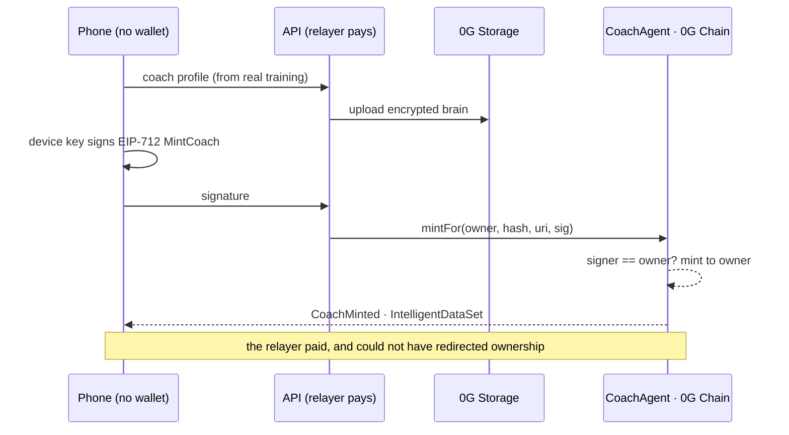

<div align="center">


<br/>

[](VERIFICATION.md#the-test-suites)
[](scripts/mutate.mjs)
[](contracts/test)
[](VERIFICATION.md#the-contract)
[](https://chainscan-galileo.0g.ai/address/0x640eecC824D54d7ECF05fa423E18673E70342809)
[](frontend/public/sw.js)

**The AI coach you own. Not a subscription — property.**

*It learns from every workout you finish, and what it learns is recorded on 0G Chain.*
*Its brain is encrypted on 0G Storage. Its advice runs sealed inside a TEE on 0G Compute.*
*Delete this app, and your coach — its identity, its history, its rental income — is still there.*

### ▶ Live: **[liftwithog.vercel.app](https://liftwithog.vercel.app)** · Prove it yourself: **[/#/verify](https://liftwithog.vercel.app/#/verify)**

*The verify page reads 0G from **your** browser — chain id, block height, coaches minted, live.*

</div>

---

## Why a coach you own

Every fitness app dies the same way: years of your training, your progress, your coach's
"knowledge of you" — rows in a company's database, gone when the company goes. LIFTWITHOG
inverts that. The coach is an **ERC-7857 Agentic ID** on 0G Chain that *your device* controls:

- 🏋️ **It learns for real, and you can read what it learned.** Finish a workout → the coach
  re-derives its profile from your actual training, writes down *what changed*, re-encrypts,
  re-uploads to 0G Storage and `evolve()`s on chain — in the background. Open its memory and
  every version is a sentence: *"barbell bench press: 85 kg → 95 kg"*, *"squat has not moved
  in 3 sessions"*. The memory is inside the payload the chain hashes, and the same text is
  what the coach reads before answering you. `version 12` is twelve things it can tell you
  about yourself, not a counter.
- 🔑 **No wallet. No gas. Still yours.** A key generated on your phone signs EIP-712 messages;
  our relayer pays the fee. The signature names the owner, so the relayer **can pay but cannot
  redirect ownership**. *Proven on chain: coach `#1`'s owner holds `0.0 0G` and owns it anyway.*
- 🔒 **Advice that can prove where it ran.** Every answer comes from a TEE-attested enclave on
  0G Compute, attestation verified per response. No attested provider live? The app **refuses**
  — it never silently falls back to an unattested one. Privacy is a checked property here,
  not a settings toggle.
- 💸 **Trainers list and earn, without ever holding a token.** Name a day rate from your
  phone — the device signs, we pay the fee — and `rent()` grants expiring access while
  forwarding the *entire* payment to you in the same transaction. The contract holds no
  balance and has no withdraw function; an invariant test drives thousands of random calls
  and asserts its balance is always zero.
- 🇮🇳 **And underneath it: a complete tracker people actually need.** 1,324 exercises, plate
  math on the bar, warm-up ramps, an India-first nutrition engine (IFCT foods, protein by
  reference weight, hard safety bounds), offline-first PWA, 11 languages, passkey accounts.

Built for the **0G Buildathon**. Designed to outlive it.

---

## The proof — read the chain, not the README

`CoachAgent` v2 is live on 0G Galileo at
[`0x640eecC824D54d7ECF05fa423E18673E70342809`](https://chainscan-galileo.0g.ai/address/0x640eecC824D54d7ECF05fa423E18673E70342809).
Ask it — not us — whether it really speaks ERC-7857:

```bash
$ cast call 0x640eecC824D54d7ECF05fa423E18673E70342809 \
    "supportsInterface(bytes4)(bool)" 0x4b396f04 --rpc-url https://evmrpc-testnet.0g.ai
true    # IERC7857

$ cast call 0x640eecC824D54d7ECF05fa423E18673E70342809 \
    "supportsInterface(bytes4)(bool)" 0x35d39512 --rpc-url https://evmrpc-testnet.0g.ai
true    # IERC7857Authorize
```

And whether gasless ownership is real — coach `#1`, minted from a phone with no wallet:

```text
totalMinted()            → 5
ownerOf(1)               → 0xC0a5916D8aCb9260D2435a9b92248fF56399d784
balance of that owner    → 0.0 0G      ← owns the coach, has never held gas
getIntelligentDatas(1)   → "AES-256-GCM encrypted coaching profile, version 1,
                            ciphertext on 0G Storage at 0x…"  ·  dataHash 0xbdaedf…
```

Every claim in this README has a command, contract call, or explorer link behind it —
the full list is **[VERIFICATION.md](VERIFICATION.md)**. One shortcut runs most of them:

```bash
npm run evidence   # reads 0G live: contract, versions, zero-gas owners, TEE provider
```

And that a trainer can earn without ever holding a token — coach `#1`, listed from a browser:

```text
rentalPrice(1)           → 0.0003 0G / day
ownerOf(1)               → 0xcEfBD045607d04e6FFDd136b30E66e728aBa2Cf7
balance of that owner    → 0.0 0G      ← listed it for rent, has never held gas
```

---

## The product

<div align="center">
<table>
  <tr>
    <td></td>
    <td></td>
    <td></td>
  </tr>
  <tr>
    <td align="center"><em>Your coach on the home screen — token <code>#5</code>, version 1, learning from 7 sessions</em></td>
    <td align="center"><em>Plate math (<code>25 + 15 /side</code>) and one-tap warm-up ramps, mid-set</em></td>
    <td align="center"><em>Targets from your weigh-ins — Mifflin-St Jeor, hard safety bounds, IFCT foods</em></td>
  </tr>
  <tr>
    <td></td>
    <td></td>
    <td></td>
  </tr>
  <tr>
    <td align="center"><em>The market — real coaches on the v2 contract, priced in 0G, payment atomic with access</em></td>
    <td align="center"><em><a href="https://liftwithog.vercel.app/#/verify">/verify</a> — live chain reads from <b>your</b> browser, not our server</em></td>
    <td></td>
  </tr>
</table>
</div>

---

## 📱 Built for the gym, not the desk

Nobody trains at a laptop. LIFTWITHOG is **mobile-first by design** — every screen above is
shown at phone size because that *is* the product: one-handed, mid-set, with chalk on the glass.

**Install it like an app** (no store, no wallet, ~1.3 MB shell):

| | |
|---|---|
| **Android** | open [liftwithog.vercel.app](https://liftwithog.vercel.app) in Chrome → **⋮ → Add to Home screen** |
| **iPhone / iPad** | open it in Safari → **Share → Add to Home Screen** |

What the installed app does that a tab doesn't:

- ⚡ **Opens with no signal.** The app shell is precached at install — we verified this by
  killing the server and reloading, not by trusting the service worker's word for it.
  Log your session in a basement gym; it syncs when you surface.
- 🔆 **The screen stays awake during a workout** (wake lock, bound to the active session,
  not the route — checking Stats mid-set won't dim it).
- ⏱️ **Rest timers beep and vibrate** with the tab in your pocket.
- 👍 **Every control is ≥44px to a thumb** — measured with `elementFromPoint` across all ten
  screens, in both themes, not eyeballed.
- 🔑 **Your coach minted from the phone itself.** The device key that owns your on-chain
  coach is generated on the phone and never leaves it — the mobile install *is* the wallet.

**Honest limitations, so nothing surprises you:**

- Passkey sign-in and cross-device sync need the hosted site (or your own HTTPS deploy);
  **guest mode works fully offline-local everywhere**.
- Scheduled workout reminders are exact when self-hosted (the server ticks every ten
  seconds and hits your chosen minute). On the hosted app they run from a scheduled
  invocation instead, and Vercel's free plan permits one a day with up to an hour of
  drift — so treat the hosted reminder as a daily nudge, not an alarm clock. Same code
  either way; only the clock differs.
- On iOS, web push requires iOS 16.4+ and vibration is not supported by Safari — the
  timers still beep.

A Capacitor iOS shell lives in [`frontend/ios`](frontend/ios) for a future App Store build;
the PWA is the shipped path today.

---

## Which 0G modules, and how

| Module | Where it sits | What it does here |
|---|---|---|
| **0G Chain** (Galileo `16602`) | [`contracts/src/CoachAgent.sol`](contracts/src/CoachAgent.sol) | The coach as property: ERC-7857 Agentic ID + ERC-721, versioned intelligent data, open-ended executor grants, expiring rentals with atomic payout, epoch-voided grants on sale, EIP-712 relayed mint/evolve |
| **0G Compute** | [`server/coach-runtime.js`](server/coach-runtime.js) | TEE-attested inference (`TeeML`), attestation verified per response, **fail-closed** — no attested provider means an honest error, never a downgrade |
| **0G Storage** | [`server/coach-runtime.js`](server/coach-runtime.js) · [`frontend/src/lib/ogVault.js`](frontend/src/lib/ogVault.js) | Two jobs: the coach's encrypted brain (keccak256-anchored on chain, tamper-checked on every ask) and the user's AES-256-GCM vault backups, encrypted **on the device** |
| **ERC-8004 Trustless Agents** | [`scripts/register-agent.mjs`](scripts/register-agent.mjs) | The coach is registered as **agent #382** on 0G's Identity Registry, with a public [agent card](https://liftwithog.vercel.app/agent-card.json) — discoverable by any 8004-aware indexer while ownership stays governed by 7857 |
| **Agentic ID / ERC-7857** | [`contracts/src/interfaces/`](contracts/src/interfaces) | Interfaces vendored **verbatim** from 0G's `agenticID-examples` so selectors match the ecosystem; `iTransferFrom` gated behind an immutable TEE/ZKP oracle slot — it refuses without one rather than pretending |
| **Payments on 0G** | [`rent()`](contracts/src/CoachAgent.sol) | Access and payment are one transaction; the trainer is paid in-line; the relayer's gas spend is the product's only operating cost, visible on the explorer |
| **0G DA** | — | **Deliberately not used.** Nothing here is a high-throughput availability stream, and a decorative integration is worse than an absent one |

The full picture — diagrams, flows, trust model — is **[ARCHITECTURE.md](ARCHITECTURE.md)**.



---

## Engineering guarantees (each one enforced by test)

| Guarantee | Mechanism | Evidence |
|---|---|---|
| The contract never holds anyone's money | payout is the last call of `rent()`; no withdraw exists | [`invariant_ContractNeverHoldsFunds`](contracts/test/CoachAgentFuzz.t.sol) across random call sequences |
| A sale voids every rental, in constant gas | epoch counter bumped in `_update`, grants keyed by epoch | [`testFuzz_SellingClearsEveryGrant`](contracts/test/CoachAgentFuzz.t.sol) |
| Renewing never steals paid days | renewal extends from current expiry | [`testFuzz_RenewingExtendsAndNeverShortens`](contracts/test/CoachAgentFuzz.t.sol) — fuzzed to the last second of the window |
| The oracle can't override the owner | ERC-721 auth runs *after* proof verification | [`test_TheOracleCannotOverrideTheOwner`](contracts/test/CoachAgent7857.t.sol) |
| A tampered brain is detected, not trusted | keccak256 of fetched ciphertext vs on-chain hash | `config_tampered` path, [`server/coach-runtime.js`](server/coach-runtime.js) |
| Unattested inference never reaches a user | TeeML required, attestation checked per response | [`server/coach-runtime.js`](server/coach-runtime.js) |
| Corrupt stored data can't invite an overwrite | "no data" and "unreadable" are different answers | [`server/store.test.js`](server/store.test.js) |
| A leaked session key can't come back | recognised **by hash** at boot, rotated, everyone signed out | [`server/store.js`](server/store.js) |
| Offline actually works | app shell precached at install, named by build hash | [`frontend/src/lib/swShell.js`](frontend/src/lib/swShell.js) + tests — measured by killing the server |
| Wrong numbers can't reach a diet or a bar | 164 seeded faults must all be caught | `node scripts/mutate.mjs` — 159 caught, 5 proven equivalent |

**668 tests**: 529 frontend · 67 server · 72 contract (47 unit, 9 fuzz, 5 invariant, 16 ERC-7857).

---

## Run it yourself

**Hosted path (what the live site runs):** static PWA + one serverless function, state in Postgres.

```bash
git clone https://github.com/Ritik200238/LIFTWITHOG && cd LIFTWITHOG
npm install && npm --prefix frontend install

# server: file-backed by default; set DATABASE_URL for Postgres
cp server/.env.example server/.env       # add RELAYER_PRIVATE_KEY + COACH_ADDRESS
node server/server.js                    # API on :3000
npm --prefix frontend run dev            # app on :5173, /api proxied
```

**Sovereign path (your data on your box):** one origin, passkeys included, media served locally.

```bash
docker compose up -d          # nginx + API + 140MB exercise media, one command
# HTTPS on a fresh VPS:  DOMAIN=gym.example.com docker compose -f docker-compose.yml -f docker-compose.https.yml up -d
```

**Verify everything:** `npm run evidence` · full suites as above · [VERIFICATION.md](VERIFICATION.md).

Deploy your own contract: `cd contracts && PRIVATE_KEY=0x… forge script script/Deploy.s.sol:Deploy --rpc-url og_testnet --broadcast --with-gas-price 3gwei --priority-gas-price 2gwei`

Register it as an ERC-8004 agent: `npm run register-agent` (add `--mainnet` for mainnet).
The whole mainnet sequence — deploy, verify the interfaces on the deployed bytecode,
register — is one rehearsed command: `npm run go-mainnet`. It refuses before spending if
the wallet is short, and skips any step already done.

---

## Buildathon requirements, mapped

| Requirement | Where |
|---|---|
| 0G contract address + explorer | [`0x640eecC824D54d7ECF05fa423E18673E70342809`](https://chainscan-galileo.0g.ai/address/0x640eecC824D54d7ECF05fa423E18673E70342809) on Galileo — mainnet (Aristotle `16661`) ships via the same one-command deploy, this line gains that address the day it lands |
| On-chain activity | 5 coaches minted, 3 listed for rent, versions climbing — [explorer](https://chainscan-galileo.0g.ai/address/0x640eecC824D54d7ECF05fa423E18673E70342809), or the live [/#/verify](https://liftwithog.vercel.app/#/verify) counter |
| Proof of 0G integration | `supportsInterface` answered by deployed bytecode, `npm run evidence`, [VERIFICATION.md](VERIFICATION.md) |
| Architecture | [ARCHITECTURE.md](ARCHITECTURE.md) — diagrams, flows, trust model, honest non-integrations |
| 0G modules used & how | table above, with file-level links |
| Reproduction steps | "Run it yourself", above — hosted and sovereign |

---

## Repository layout

```
contracts/        CoachAgent.sol (ERC-7857 + ERC-721) · vendored 0G interfaces · 67 Foundry tests
server/           the API — auth (passkeys), sync, coach runtime (0G Compute/Storage), relayer
                  store.js: file backend for self-hosting, Postgres for serverless
api/              exactly one file: the Vercel entry point wrapping server/
frontend/         React PWA — workout, nutrition, coach, market, /verify · 510 tests
scripts/          evidence.mjs (live chain checks) · mutate.mjs (164-fault mutation harness)
docs/             self-hosting (Docker/HTTPS) · mobile
```

The workout tracker core builds on the open-source **openGym** project. The 0G integration,
`CoachAgent`, the coach runtime, the nutrition engine, offline layer, stateless server, and
everything above `1.0.0` in the [CHANGELOG](CHANGELOG.md) is this project's work.

<div align="center">

**[Live app](https://liftwithog.vercel.app)** · **[Verify](https://liftwithog.vercel.app/#/verify)** · **[Architecture](ARCHITECTURE.md)** · **[Every claim, checked](VERIFICATION.md)** · **[Changelog](CHANGELOG.md)**

</div>
