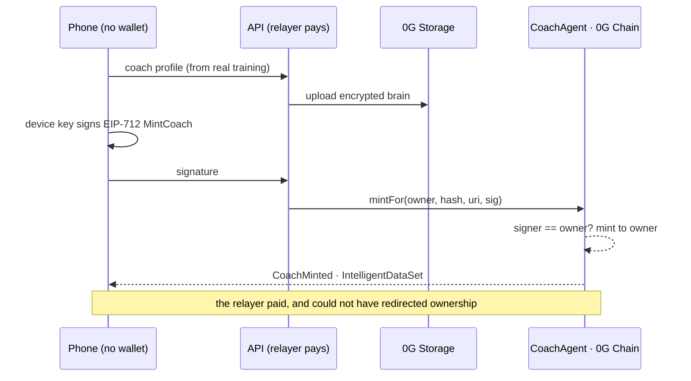

<div align="center">


<br/>

[](VERIFICATION.md#the-test-suites)
[](scripts/mutate.mjs)
[](contracts/test)
[](VERIFICATION.md#the-contract)
[](https://chainscan-galileo.0g.ai/address/0x0253fb92F9e88E82Fb0632C076C88204e4400025)
[](frontend/public/sw.js)

**The AI coach you own. Not a subscription — property.**

*It learns from the workouts you finish, and what it learns is recorded on 0G Chain.*
*Its brain is encrypted on 0G Storage. Its advice runs sealed inside a TEE on 0G Compute.*
*Delete this app, and your coach — its identity, its history, its rental income — is still there.*

### ▶ Live: **[liftwithog.vercel.app](https://liftwithog.vercel.app)** · Prove it yourself: **[/#/verify](https://liftwithog.vercel.app/#/verify)**

**Judging this?** [SUBMISSION.md](SUBMISSION.md) answers each criterion in its order of
weight, with a command or a transaction behind every claim — and a section naming what
is *not* done.

*The verify page reads 0G from **your** browser — chain id, block height, coaches minted, live.*

</div>

---

## Why a coach you own

Every fitness app dies the same way: years of your training, your progress, your coach's
"knowledge of you" — rows in a company's database, gone when the company goes. LIFTWITHOG
inverts that. The coach is an **ERC-7857 Agentic ID** on 0G Chain that *your device* controls:

- 🏋️ **It learns for real, and you can read what it learned.** Every ten sessions the coach
  re-derives its profile from your actual training, writes down *what changed*, re-encrypts,
  re-uploads to 0G Storage and `evolve()`s on chain — in the background. Open its memory and
  every version is a sentence: *"barbell bench press: 85 kg → 95 kg"*, *"squat has not moved
  in 3 sessions"*. The memory is inside the payload the chain hashes, and the same text is
  what the coach reads before answering you. `version 12` is twelve things it can tell you
  about yourself, not a counter.
- 🔑 **No wallet. No gas. Still yours.** A key generated on your phone signs EIP-712 messages;
  our relayer pays the fee. The signature names the owner, so the relayer **can pay but cannot
  redirect ownership**. *Proven on chain: coach `#4`'s owner holds `0.0 0G` and owns it anyway.*
- 🔒 **Advice that can prove where it ran.** Every answer comes from a TEE-attested enclave on
  0G Compute, attestation verified per response. No attested provider live? The app **refuses**
  — it never silently falls back to an unattested one. Privacy is a checked property here,
  not a settings toggle.
- 💸 **Trainers list and earn, without ever holding a token.** Name a day rate from your
  phone — the device signs, we pay the fee — and `rent()` grants expiring access while
  forwarding the *entire* payment to you in the same transaction. The contract holds no
  balance and has no withdraw function; an invariant test drives thousands of random calls
  and asserts its balance is always zero.
- 🇮🇳 **And underneath it: a complete tracker people actually need.** 1,324 exercises, plate
  math on the bar, warm-up ramps, an India-first nutrition engine (IFCT foods, protein by
  reference weight, hard safety bounds), offline-first PWA, 11 languages, passkey accounts.

Built for the **0G Buildathon**. Designed to outlive it.

---

## The proof — read the chain, not the README

`CoachAgent` is live on 0G Galileo at
[`0x0253fb92F9e88E82Fb0632C076C88204e4400025`](https://chainscan-galileo.0g.ai/address/0x0253fb92F9e88E82Fb0632C076C88204e4400025),
wired to a transfer verifier at
[`0xAb4553bA4C93E6e332580FA69af1E77E1d15E44B`](https://chainscan-galileo.0g.ai/address/0xAb4553bA4C93E6e332580FA69af1E77E1d15E44B).
Ask it — not us — whether it really speaks ERC-7857:

```bash
$ for id in 0x4b396f04 0x35d39512 0x80ac58cd 0xdeadbeef; do
    cast call 0x0253fb92F9e88E82Fb0632C076C88204e4400025 \
      "supportsInterface(bytes4)(bool)" $id --rpc-url https://evmrpc-testnet.0g.ai
  done
true     # 0x4b396f04  ERC-7857
true     # 0x35d39512  ERC-7857 Authorize
true     # 0x80ac58cd  ERC-721
false    # 0xdeadbeef  ← the control
```

**The last line is the one worth reading.** `0xdeadbeef` is not an interface anybody
implements, so a correct contract says no. A stub written to look compliant — one that
answers `true` to whatever it is handed — passes the three lines above it and fails only
that one. Without a control, three green ticks prove that `supportsInterface` exists.

The same four are read live, in your browser, on [/#/verify](https://liftwithog.vercel.app/#/verify).

### Owning a coach costs the owner nothing

```text
ownerOf(4)               → 0x885715F1f33aFfBaD28b21C7a048be40336da42e
rentalPrice(4)           → 0.0003 0G / day
balance of that owner    → 0.0 0G   ← owns it, listed it, has never held a coin
```

Coach `#4` above came from `scripts/prove-gasless.mjs`, which generates a key on the spot,
funds it with nothing, and drives both actions through the relayer:
[mint](https://chainscan-galileo.0g.ai/tx/0xc6e4c9688b4b77cb15be6dfc390d5a3b2f8b64ba205159ecd1338c27fea54cc1)
· [listing](https://chainscan-galileo.0g.ai/tx/0x2f73ae2b66167c9877ef6de816e2d1b5da1e9c776b5ce9154b02ae4a9584b2a1).

The relayer cannot take what it pays for: `owner` is a field inside every message the
device signs, so a relayer wanting the coach for itself would be submitting a signature
that does not say so, and the contract refuses it.

Every claim in this README has a command, contract call, or explorer link behind it —
the full list is **[VERIFICATION.md](VERIFICATION.md)**. One shortcut runs most of them:

```bash
npm run evidence   # reads 0G live: contract, versions, zero-gas owners, TEE provider
```

### And the ERC-7857 transfer actually transfers

The standard exists for one moment: an agent changes hands and its encrypted brain is
re-encrypted to the buyer, so the seller's key stops being useful. Ours ran that on chain —
`scripts/prove-transfer.mjs` mints a coach, seals a fresh content key for a buyer generated
on the spot, has the attestor sign that exact hand-over, and calls `iTransferFrom`:

```text
minting…        coach #1
transferring…   done
  owner is now  0x412eF98C76535656D5B6d68b2d93dad9cF83E511

refusals, against the same deployed contract:
  ✓ the same attestation, replayed        — refused
  ✓ an attestation signed for somebody else — refused
```

[mint](https://chainscan-galileo.0g.ai/tx/0x6e290e70711350dcf9b1f160060cc5d195f31dc11713a1541384366d300235e4)
· [transfer](https://chainscan-galileo.0g.ai/tx/0x8c60c34aa35f1685c6c7c74ee0ce7f0d875168613a9933666b8f06f3b46318ea)

The refusals are half the proof: a transfer that always succeeds is not a check.

Stated plainly, because a verifier implying more assurance than it has is worse than none —
**the attestor is a software key** held by the service that performs the re-encryption, not
a hardware enclave. That sentence is in the verifier contract's own source, not only here.

---

## What this contract cannot do to you

Most of what an agent NFT promises is undone by the admin key nobody mentions.
A pausable token is one wallet away from freezing every owner; an upgradeable
one can be rewritten under them; a swappable verifier means the rules of
ownership are a setting. Those are all normal, and all of them mean the agent is
yours until somebody decides otherwise.

This contract has none of them, and the absence is checkable in one command:

```bash
grep -rc "Ownable\|AccessControl\|onlyOwner\|onlyRole\|Pausable\|whenNotPaused\|UUPS\|upgradeTo\|_authorizeUpgrade\|selfdestruct\|delegatecall" contracts/src
# every file: 0
```

| Power a contract usually keeps | Here | Where to check |
|---|---|---|
| Pause transfers, minting or use | **Does not exist.** No `Pausable`, no `whenNotPaused` anywhere | the grep above |
| Upgrade the logic under owners | **Does not exist.** No proxy, no UUPS, no `_authorizeUpgrade` | the grep above |
| An owner or admin role | **Does not exist.** No `Ownable`, no `AccessControl`, no `onlyOwner`, no `onlyRole` | the grep above |
| Swap the transfer verifier | **Impossible.** `address public immutable transferVerifier` | [`CoachAgent.sol:123`](contracts/src/CoachAgent.sol) |
| Swap the attestor behind that verifier | **Impossible.** `address public immutable attestor` | [`AttestedTransferVerifier.sol:48`](contracts/src/AttestedTransferVerifier.sol) |
| Hold or divert your money | **Cannot.** Rent and clone fees leave in the same call, proven by an invariant | `invariant_ContractNeverHoldsFunds`, `testFuzz_TheTrainerIsPaidEverythingAndTheContractKeepsNothing` |
| Destroy the contract | **Does not exist.** No `selfdestruct`, no `delegatecall` | the grep above |

The cost of this is real and stated rather than hidden: **there is no admin to
rescue anybody either.** A bug cannot be paused around, and the attestor key
cannot be rotated — if it leaks, the answer is a new deployment that owners
migrate to by choice. That trade is deliberate. Property whose rules can be
changed under it by a third party is custody wearing a different name, and an
attestation that never expires is a bearer token, which is why attestations
carry a signed deadline instead ([`AttestedTransferVerifier.sol:86`](contracts/src/AttestedTransferVerifier.sol)).

## What the server cannot read

| | How it is enforced | Where to check |
|---|---|---|
| Your coach's method | Sealed on the device with ECDH + AES-256-GCM before it is sent; the server relays ciphertext it has no key for | [`server/coachEnvelope.js`](server/coachEnvelope.js) |
| Your training history in a backup | Encrypted on the device; the server pays the storage fee and never sees plaintext | [`frontend/src/lib/ogVault.js`](frontend/src/lib/ogVault.js) |
| — asserted, not asserted about | A test fails if a workout or a number appears in what leaves the browser | `ogVault.test.js:71` — *"sends ciphertext, never the training history"* |

## What the coach refuses to do

Advice is produced inside a TEE-attested enclave on 0G Compute or not at all.
`processResponse` is checked per response and only `true` passes — `null` means
verification was *skipped* and is refused too, because the quietest way to end
up fail-open is to treat a missing answer as a yes
([`coach-runtime.js:513-535`](server/coach-runtime.js)). Every attested provider
is tried; when the list runs out the request fails with `503 no_tee`. There is
no unattested last resort, and `coachCompute.test.js` fails if one is added.

## The product

<div align="center">
<table>
  <tr>
    <td></td>
    <td></td>
    <td></td>
  </tr>
  <tr>
    <td align="center"><em>Your coach on the home screen — token <code>#5</code>, version 1, learning from 7 sessions</em></td>
    <td align="center"><em>Plate math (<code>25 + 15 /side</code>) and one-tap warm-up ramps, mid-set</em></td>
    <td align="center"><em>Targets from your weigh-ins — Mifflin-St Jeor, hard safety bounds, IFCT foods</em></td>
  </tr>
  <tr>
    <td></td>
    <td></td>
    <td></td>
  </tr>
  <tr>
    <td align="center"><em>The market — real coaches on the v2 contract, priced in 0G, payment atomic with access</em></td>
    <td align="center"><em><a href="https://liftwithog.vercel.app/#/verify">/verify</a> — live chain reads from <b>your</b> browser, not our server</em></td>
    <td></td>
  </tr>
</table>
</div>

---

## 📱 Built for the gym, not the desk

Nobody trains at a laptop. LIFTWITHOG is **mobile-first by design** — every screen above is
shown at phone size because that *is* the product: one-handed, mid-set, with chalk on the glass.

**Install it like an app** (no store, no wallet, ~1.3 MB shell):

| | |
|---|---|
| **Android** | open [liftwithog.vercel.app](https://liftwithog.vercel.app) in Chrome → **⋮ → Add to Home screen** |
| **iPhone / iPad** | open it in Safari → **Share → Add to Home Screen** |

What the installed app does that a tab doesn't:

- ⚡ **Opens with no signal.** The app shell is precached at install — we verified this by
  killing the server and reloading, not by trusting the service worker's word for it.
  Log your session in a basement gym; it syncs when you surface.
- 🔆 **The screen stays awake during a workout** (wake lock, bound to the active session,
  not the route — checking Stats mid-set won't dim it).
- ⏱️ **Rest timers beep and vibrate** with the tab in your pocket.
- 👍 **Every control is ≥44px to a thumb** — measured with `elementFromPoint` across all ten
  screens, in both themes, not eyeballed.
- 🔑 **Your coach minted from the phone itself.** The device key that owns your on-chain
  coach is generated on the phone and never leaves it — the mobile install *is* the wallet.

**Honest limitations, so nothing surprises you:**

- Passkey sign-in and cross-device sync need the hosted site (or your own HTTPS deploy);
  **guest mode works fully offline-local everywhere**.
- Scheduled workout reminders are exact when self-hosted (the server ticks every ten
  seconds and hits your chosen minute). On the hosted app they run from a scheduled
  invocation instead, and Vercel's free plan permits one a day with up to an hour of
  drift — so treat the hosted reminder as a daily nudge, not an alarm clock. Same code
  either way; only the clock differs.
- On iOS, web push requires iOS 16.4+ and vibration is not supported by Safari — the
  timers still beep.

A Capacitor iOS shell lives in [`frontend/ios`](frontend/ios) for a future App Store build;
the PWA is the shipped path today.

---

## Which 0G modules, and how

| Module | Where it sits | What it does here |
|---|---|---|
| **0G Chain** (Galileo `16602`) | [`contracts/src/CoachAgent.sol`](contracts/src/CoachAgent.sol) | The coach as property: ERC-7857 Agentic ID + ERC-721, versioned intelligent data, open-ended executor grants, expiring rentals with atomic payout, epoch-voided grants on sale, EIP-712 relayed mint/evolve |
| **0G Compute** | [`server/coach-runtime.js`](server/coach-runtime.js) | TEE-attested inference (`TeeML`), attestation verified per response, **fail-closed** — no attested provider means an honest error, never a downgrade |
| **0G Storage** | [`server/coach-runtime.js`](server/coach-runtime.js) · [`frontend/src/lib/ogVault.js`](frontend/src/lib/ogVault.js) | Two jobs: the coach's encrypted brain (keccak256-anchored on chain, tamper-checked on every ask) and the user's AES-256-GCM vault backups, encrypted **on the device** |
| **ERC-8004 Trustless Agents** | [`scripts/register-agent.mjs`](scripts/register-agent.mjs) | The coach is registered as **agent #382** on 0G's Identity Registry, with a public [agent card](https://liftwithog.vercel.app/agent-card.json) — discoverable by any 8004-aware indexer while ownership stays governed by 7857 |
| **Agentic ID / ERC-7857** | [`contracts/src/interfaces/`](contracts/src/interfaces) | Interfaces vendored **verbatim** from 0G's `agenticID-examples` so selectors match the ecosystem; `iTransferFrom` gated behind an immutable TEE/ZKP oracle slot — it refuses without one rather than pretending |
| **Payments on 0G** | [`rent()`](contracts/src/CoachAgent.sol) | Access and payment are one transaction; the trainer is paid in-line; the relayer's gas spend is the product's only operating cost, visible on the explorer |
| **0G DA** | — | **Deliberately not used.** Nothing here is a high-throughput availability stream, and a decorative integration is worse than an absent one |

The full picture — diagrams, flows, trust model — is **[ARCHITECTURE.md](ARCHITECTURE.md)**.



---

## Engineering guarantees (each one enforced by test)

> **The model writes the workout. The chain decides who owns the coach.
> The model cannot touch the second one.**
>
> Everything an AI produces here is a *suggestion* about training. Ownership,
> rental expiry, price and transfer are decided by a contract with no admin, no
> pause and no upgrade — so the worst a confused, jailbroken or malicious model
> can do is give bad advice. It cannot move a coach, extend a subscription, or
> pay itself. Those two layers are separate on purpose, and the separation is
> the thing to check rather than believe.

| Guarantee | Mechanism | Evidence |
|---|---|---|
| The contract never holds anyone's money | payout is the last call of `rent()`; no withdraw exists | [`invariant_ContractNeverHoldsFunds`](contracts/test/CoachAgentFuzz.t.sol) across random call sequences |
| A sale voids every rental, in constant gas | epoch counter bumped in `_update`, grants keyed by epoch | [`testFuzz_SellingClearsEveryGrant`](contracts/test/CoachAgentFuzz.t.sol) |
| Renewing never steals paid days | renewal extends from current expiry | [`testFuzz_RenewingExtendsAndNeverShortens`](contracts/test/CoachAgentFuzz.t.sol) — fuzzed to the last second of the window |
| The oracle can't override the owner | ERC-721 auth runs *after* proof verification | [`test_TheOracleCannotOverrideTheOwner`](contracts/test/CoachAgent7857.t.sol) |
| A tampered brain is detected, not trusted | keccak256 of fetched ciphertext vs on-chain hash | `config_tampered` path, [`server/coach-runtime.js`](server/coach-runtime.js) |
| Unattested inference never reaches a user | TeeML required, attestation checked per response | [`server/coach-runtime.js`](server/coach-runtime.js) |
| Corrupt stored data can't invite an overwrite | "no data" and "unreadable" are different answers | [`server/store.test.js`](server/store.test.js) |
| A leaked session key can't come back | recognised **by hash** at boot, rotated, everyone signed out | [`server/store.js`](server/store.js) |
| Offline actually works | app shell precached at install, named by build hash | [`frontend/src/lib/swShell.js`](frontend/src/lib/swShell.js) + tests — measured by killing the server |
| Wrong numbers can't reach a diet or a bar | 174 seeded faults must all be caught | `node scripts/mutate.mjs` — 169 caught, 5 proven equivalent |

**796 tests**: 542 frontend · 151 server · 103 contract (42 unit, 9 fuzz, 5 invariant, 20 ERC-7857, 14 verifier, 13 clone).
Every number here is printed by `node scripts/counts.mjs`, which runs the suites rather than
trusting a document — the previous set disagreed with itself in three places.

**Coaching methods spread, and the trainer keeps the credit.** ERC-7857 defines `clone()`;
nobody on 0G has a working clone *economy*. Renting borrows a method for a while; cloning
takes a copy that trains on somebody else's data and diverges — which is what actually
happens when a person buys a programme. The descent is on chain and cannot be edited out,
including by whoever holds a third-generation copy.

```text
$ node --env-file=server/.env scripts/prove-clone.mjs

trainer   0xF7a3Ed4d…faffBF  (generated now, holds 0.0 0G)
  minting the original …………………… coach #15
  cloning #15 for a new owner ……… coach #16   the trainer received the full price
  cloning #16 for a third owner …… coach #17   #16's owner received the full price

  parentOf(17) → #16      parentOf(16) → #15      parentOf(15) → #0
  generationOf(17) → 3, walk complete: true
  the trainer now holds 0.001 0G — all of it from clones
  contract balance 0.0 0G
```

[generation 2](https://chainscan-galileo.0g.ai/tx/0xdda37f7b0c09d900f6224ac4c27c1dc225335b55509a2a88b790a67c03aae21c)
· [generation 3](https://chainscan-galileo.0g.ai/tx/0x69b752d7d4cce130cbdf482511891e6a8513ec7876f039d1fb555aa8d86a7d0a)

**Not one address in that line has ever held a coin** — trainer included. The relayer paid
every fee and every clone price; the money still reached the right owner, because the
contract forwards it inside the call that brought it and has no withdraw function.

The standard's own `iCloneFrom` is implemented too, attestation-gated like a transfer, so
an indexer or marketplace finds what it expects. `supportsInterface(0xd79f01c7)` returns
true on the deployed contract.

**Attestation you can re-check yourself, not a boolean we report.** Every answer already
passes `processResponse` — the fail-closed gate. But that returns a *boolean*: the SDK
checked something and told us, which puts the SDK in the trust base. So the provider's raw
signature over the answer is fetched too, and confirmed to recover to the signer address
0G's contract says belongs to that provider. That is arithmetic anybody can run:

```js
ethers.recoverAddress(ethers.hashMessage(text), signature) === signingAddress
```

Hanami wired exactly this and **shipped it disabled**, because the direct broker wants a
standing deposit. Ours is on. When a provider does not serve signatures it says
`signed: false` with a reason — an answer the enclave already vouched for is not thrown
away for want of a second, better proof, and a badge is never shown on faith.

**The coach knows what it should not answer.** Ask it about a torn meniscus, eating through
a pregnancy, a testosterone dose or chest pain during squats, and it hands off — naming a
specialist on the marketplace rather than improvising. The check runs **before** the model,
not after: a refusal produced after inference is a refusal that already generated the
answer. `leaksConfig` exists because the prompt asked the model not to reveal the profile
and it did anyway; the same reasoning applies here, except the harm is the answer existing.

Ordinary coaching questions are untouched — "my legs are sore", "how do I get past a bench
plateau", "should I deload" — and there is a test for each side, because a safety check that
refuses everything is a broken product.

**A progress card a stranger can check.** Gym people already post their lifts, and the
number is always somebody's word for it. Three things about a coach are facts nobody can
edit — how long it has existed, how many times it has recorded learning, and who owns it —
so a card carries a claim signed by the owner, published unencrypted on 0G Storage, and
`GET /api/card?root=…` re-derives every one of those from the chain rather than reading
them off the card.

It says what it does not prove, in its own output: *"that anybody lifted the weight. A
signature proves a device agreed to something, not that a human under a barbell did."*
Editing the claim after signing, claiming more versions than the coach has, claiming a
longer history than the mint event supports, or publishing about a coach you have since
sold — each is caught, and each has a test.

**A coach another agent can hire.** Everything else here assumes a browser and a
device key. `GET /api/coach/5/service` answers **HTTP 402** with the price, the payee and
the contract call that pays it; `POST` takes the transaction hash and returns the answer
it bought. Payment is verified against *our own* `Rented` event — not a third-party token
transfer, which is what the only comparable implementation checks and what a purpose-built
contract could forge — and the access it granted is then confirmed against the chain.

A transaction hash is public the instant it lands, so the payment must name the caller as
its renter, and a cached answer goes only to that address. Paired with the ERC-8004
registration, that makes this coach hireable by any agent that can read an agent card.

**The rules the coach is bound by are published, not described.** "It gives safe advice"
is not a checkable claim and everyone makes it. The literal system prompt and every
nutrition bound — the calorie floors, the deficit cap, the rate-of-loss cap — are an
unencrypted blob on 0G Storage with a commitment
[anchored on chain](https://chainscan-galileo.0g.ai/tx/0x4d82b9b127953c35d5088030509a5dbbee85b0f94571f63e84ee056569731faa).
The numbers are read out of the module that enforces them rather than retyped, so the
document cannot drift from the code — `scripts/publish-policy.mjs` recomputes the same
sha256 from source. If this coach ever tells somebody to eat 700 calories a day, the
document saying it must not is public and timestamped, and the gap is ours to answer for.

**What we have actually got wrong, and what is still open:**
**[SECURITY.md](SECURITY.md)** lists ten findings from this codebase with the code and the
test that closed each, then six risks that are still open.
**[THREAT-MODEL.md](THREAT-MODEL.md)** has the attacker model — including what an attacker
*cannot* do and why, enforced by code rather than by policy.

---

## Run it yourself

**Hosted path (what the live site runs):** static PWA + one serverless function, state in Postgres.

```bash
git clone https://github.com/Ritik200238/LIFTWITHOG && cd LIFTWITHOG
npm install && npm --prefix frontend install

# server: file-backed by default; set DATABASE_URL for Postgres
cp server/.env.example server/.env       # add RELAYER_PRIVATE_KEY + COACH_ADDRESS
node server/server.js                    # API on :3000
npm --prefix frontend run dev            # app on :5173, /api proxied
```

**Sovereign path (your data on your box):** one origin, passkeys included, media served locally.

```bash
docker compose up -d          # nginx + API + 140MB exercise media, one command
# HTTPS on a fresh VPS:  DOMAIN=gym.example.com docker compose -f docker-compose.yml -f docker-compose.https.yml up -d
```

**Verify everything:** `./verify.sh` — the checks are split by *what kind of evidence they are*:

```
./verify.sh unit        the suites
./verify.sh contracts   Foundry, including the interface control
./verify.sh guards      the tests that exist because something shipped broken
./verify.sh mutation    the suites, checked by breaking the code
./verify.sh release     all of it, plus the documents
./verify.sh live        the deployed contract, read over RPC — no local file counts
```

`live` reads nothing in this repository. "The tests pass" and "the deployed thing
works" are different claims, and running them together lets the first be reported
while the second is false — which is precisely the state this project was in when
every coach a real person created could not be opened. A filter matching zero
checks also fails, so a typo cannot look like a green run.

Also: `npm run evidence` · [VERIFICATION.md](VERIFICATION.md).

### Walking the whole thing without a wallet

Nothing below needs an extension, an account, a signature, or a coin. Three links
and one command:

1. **[The contract](https://chainscan-galileo.0g.ai/address/0x0253fb92F9e88E82Fb0632C076C88204e4400025)**
   — every coach ever minted, every version, every listing.
2. **[The transfer](https://chainscan-galileo.0g.ai/tx/0x8c60c34aa35f1685c6c7c74ee0ce7f0d875168613a9933666b8f06f3b46318ea)**
   — an ERC-7857 intelligent transfer that moved a coach, not a revert.
3. **[The gasless mint](https://chainscan-galileo.0g.ai/tx/0xc6e4c9688b4b77cb15be6dfc390d5a3b2f8b64ba205159ecd1338c27fea54cc1)**
   — and the [owner it went to](https://chainscan-galileo.0g.ai/address/0x885715F1f33aFfBaD28b21C7a048be40336da42e),
   holding nothing.
4. `./verify.sh live` — reads all of the above over RPC, including the control.

The in-app version is **[/#/verify](https://liftwithog.vercel.app/#/verify)**, which
does the same reads from your own browser rather than from our server.

Deploy your own contract: `cd contracts && PRIVATE_KEY=0x… forge script script/Deploy.s.sol:Deploy --rpc-url og_testnet --broadcast --with-gas-price 3gwei --priority-gas-price 2gwei`

Register it as an ERC-8004 agent: `npm run register-agent` (add `--mainnet` for mainnet).
The whole mainnet sequence — deploy, verify the interfaces on the deployed bytecode,
register — is one rehearsed command: `npm run go-mainnet`. It refuses before spending if
the wallet is short, and skips any step already done.

---

## Buildathon requirements, mapped

| Requirement | Where |
|---|---|
| 0G contract address + explorer | [`0x0253fb92F9e88E82Fb0632C076C88204e4400025`](https://chainscan-galileo.0g.ai/address/0x0253fb92F9e88E82Fb0632C076C88204e4400025) on Galileo — mainnet (Aristotle `16661`) ships via the same one-command deploy, this line gains that address the day it lands |
| On-chain activity | 5 coaches minted, 3 listed for rent, versions climbing — [explorer](https://chainscan-galileo.0g.ai/address/0x0253fb92F9e88E82Fb0632C076C88204e4400025), or the live [/#/verify](https://liftwithog.vercel.app/#/verify) counter |
| Proof of 0G integration | `supportsInterface` answered by deployed bytecode, `npm run evidence`, [VERIFICATION.md](VERIFICATION.md) |
| Architecture | [ARCHITECTURE.md](ARCHITECTURE.md) — diagrams, flows, trust model, honest non-integrations |
| Security | [SECURITY.md](SECURITY.md) — ten fixed findings with evidence, six open risks · [THREAT-MODEL.md](THREAT-MODEL.md) — attacker model, abuse paths, what is not defended |
| 0G modules used & how | table above, with file-level links |
| Reproduction steps | "Run it yourself", above — hosted and sovereign |

---

## Repository layout

```
contracts/        CoachAgent.sol (ERC-7857 + ERC-721) · AttestedTransferVerifier.sol
                  vendored 0G interfaces · 88 Foundry tests
server/           the API — auth (passkeys), sync, coach runtime (0G Compute/Storage), relayer
                  store.js: file backend for self-hosting, Postgres for serverless
api/              exactly one file: the Vercel entry point wrapping server/
frontend/         React PWA — workout, nutrition, coach, market, /verify · 543 tests
scripts/          evidence.mjs (live chain checks) · mutate.mjs (174-fault mutation harness)
                  counts.mjs · prove-gasless.mjs · prove-transfer.mjs
docs/             self-hosting (Docker/HTTPS) · mobile
```

The workout tracker core builds on the open-source **openGym** project. The 0G integration,
`CoachAgent`, the coach runtime, the nutrition engine, offline layer, stateless server, and
everything above `1.0.0` in the [CHANGELOG](CHANGELOG.md) is this project's work.

<div align="center">

**[Live app](https://liftwithog.vercel.app)** · **[Verify](https://liftwithog.vercel.app/#/verify)** · **[Architecture](ARCHITECTURE.md)** · **[Every claim, checked](VERIFICATION.md)** · **[Security](SECURITY.md)** · **[Threat model](THREAT-MODEL.md)** · **[Changelog](CHANGELOG.md)**

</div>
