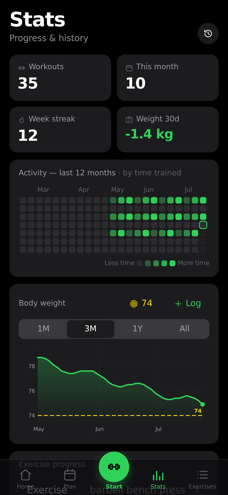

<div align="center">


<br><br>

# 🏋️‍♂️ LIFTWITHOG

**A sovereign, AI-powered workout, nutrition & health tracking ecosystem built on 0G.**

*Architected & Built by **[Ritik](https://github.com/Ritik200238)***

<br>

[](https://github.com/Ritik200238)
[](LICENSE)
[](https://0g.ai)
[](https://react.dev)
[](https://www.docker.com/)
[](#sovereignty--privacy)

</div>

<br>

<div align="center">
<table>
<tr>
<td align="center"><br><sub><b>Home Dashboard</b> — Guided workouts & weekly split</sub></td>
<td align="center"><br><sub><b>Active Session</b> — Animated demos & dynamic rest timer</sub></td>
<td align="center"><br><sub><b>Analytics & PRs</b> — Muscle heatmaps & progression charts</sub></td>
</tr>
</table>
</div>

---

## 🌟 Why LIFTWITHOG?

Traditional fitness apps lock your personal biometrics behind proprietary silos, sell health metrics to advertisers, and lose your data if their servers go down.

**LIFTWITHOG is built differently:**
- **Your Data Stays Yours**: Runs 100% locally or on your self-hosted instance. All health records, PRs, and bodyweight measurements are encrypted on the client side using ECIES keys before being archived to **0G Decentralized Storage**.
- **On-Chain AI Coaching**: Your personal coach is a persistent, evolving ERC-721 Agent on **0G Chain** with versioned training history.
- **Hardware-Enclave Privacy (TEE)**: Inference executes inside confidential Trusted Execution Environments (TEEs) on **0G Compute**, guaranteeing that fitness queries and training methods never leak.
- **Pure Arithmetic Nutrition**: Calculates BMR, TDEE, macro breakdowns, and real-food meal plans via mathematical proofs rather than hallucinating AI outputs.

---

## ⚡ Key Features

- 🧠 **Autonomous 0G Coach**: Gasless on-chain AI agent that evolves as you log workouts, recording permanent training milestones directly to 0G Galileo Testnet.
- 🔒 **Confidential TEE Inference**: AI workout guidance and form advice processed strictly within verified hardware enclaves on 0G Compute.
- ⚡ **ECIES Encrypted 0G Vault**: Automated encrypted backup and recovery using 0G Storage & 0G Key-Value storage.
- 🔑 **Passkey-First Authentication**: WebAuthn biometric login (Touch ID, Face ID, Windows Hello) with zero passwords stored anywhere.
- 🏋️ **1,324 Exercise Database**: Searchable local library with animations, target muscle group activations, and custom exercise creation.
- 📊 **Progression Systems**: Built-in linear progression, Greyskull LP, double progression, and bodyweight rep-climb policies.
- 🍽️ **Calculated Nutrition Engine**: Mifflin-St Jeor metabolic scoring with macro scaling and automated grocery portioning across 4 dietary styles.
- 📱 **Multi-Platform Deployment**: Seamless PWA installable on iOS/Android, standalone Docker container, or native mobile builds via Capacitor.

---

## 🔬 Verifiable 0G Evidence

Every on-chain and decentralized claim in LIFTWITHOG is publicly verifiable on-chain:

```bash
npm run evidence
```

| Component | Verification / Proof |
|---|---|
| **Coach Agent Contract** | [`0x70c4dE9D0edbE53733821558Bf6b14b64451e56E`](https://chainscan-galileo.0g.ai/address/0x70c4dE9D0edbE53733821558Bf6b14b64451e56E) |
| **Gasless Device Ownership** | Device generates local cryptographic keys; relayer funds on-chain minting |
| **State Evolution** | Versioned on-chain state anchors (`version 3+`) pushed automatically post-workout |
| **Atomic Payment & Access** | Direct trainer royalty payments executed in a single atomic transaction |
| **TEE Attestation** | Real-time enclave cryptographic attestation verified via 0G Compute SDK |

---

## 🚀 Quick Start

### 1. Run with Docker Compose (Recommended)

```bash
# Clone the repository
git clone https://github.com/Ritik200238/LIFTWITHOG.git
cd LIFTWITHOG

# Start all services
docker compose up -d --build
```
Open **`http://localhost:8080`** in your browser, tap **Create profile**, and sign in with your passkey.

---

### 2. Manual Development Setup

#### Frontend Setup:
```bash
cd frontend
npm install
npm run dev
```

#### Backend API Setup:
```bash
cd api
npm install
npm start
```

---

## 🧪 Testing & Code Quality

LIFTWITHOG maintains rigorous test coverage across all subsystems:

```bash
# Frontend — 510 vitest tests
npm --prefix frontend test

# Server — 64 node:test tests (auth, storage backends, sync rules)
npm test

# Contract — 67 Foundry tests: 42 unit · 9 fuzz · 5 invariant · 16 ERC-7857
cd contracts && forge test

# Mutation testing — 164 seeded faults; fails unless the tests notice
node scripts/mutate.mjs
```

Architecture, flows and the trust model: **[ARCHITECTURE.md](ARCHITECTURE.md)**.
Every claim with the command or explorer link that checks it:
**[VERIFICATION.md](VERIFICATION.md)** — or the live, in-app version at
[liftwithog.vercel.app/#/verify](https://liftwithog.vercel.app/#/verify).

---

## 🛠️ Technology Stack

- **Frontend**: React 19, Zustand, Vite, Capacitor (iOS/Android)
- **Backend**: Node.js, WebAuthn (@simplewebauthn), Web Push
- **Web3 & AI**:
  - `@0gfoundation/0g-compute-ts-sdk` (TEE confidential inference)
  - `@0gfoundation/0g-storage-ts-sdk` (Encrypted decentralized backup)
  - `ethers.js` (EIP-712 signing & ERC-721 interactions)
  - Solidity `0.8.28` / Foundry

---

## 👤 Author & Maintainer

**Ritik**
- GitHub: [@Ritik200238](https://github.com/Ritik200238)
- Project Repository: [Ritik200238/LIFTWITHOG](https://github.com/Ritik200238/LIFTWITHOG)

---

## 📄 License

This project is open-source and licensed under the **[MIT License](LICENSE)**.

Copyright © 2026 **Ritik**. All rights reserved.
