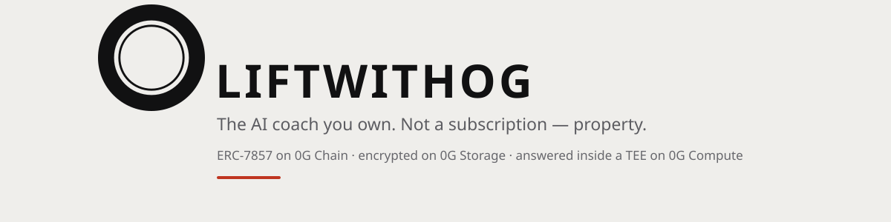
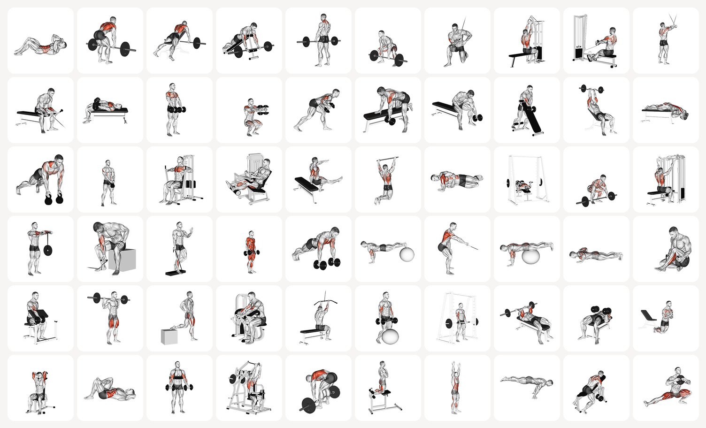
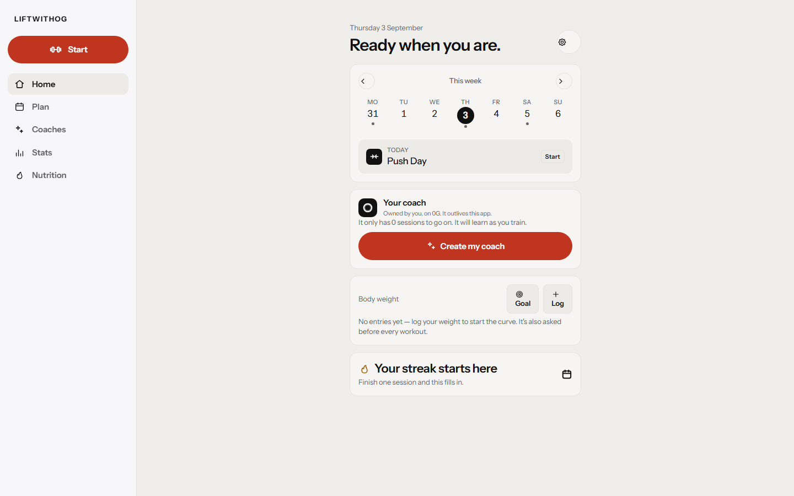
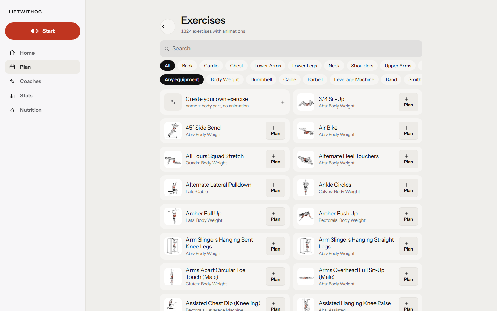
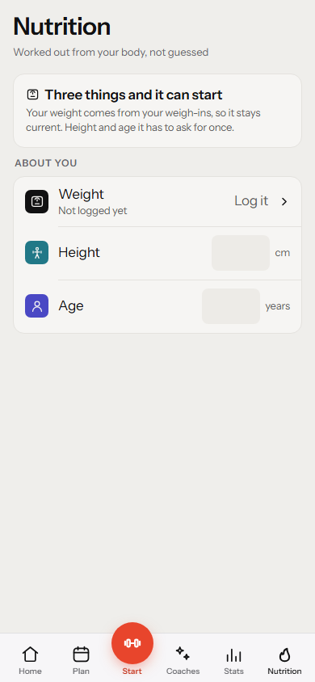
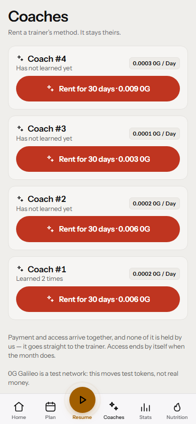
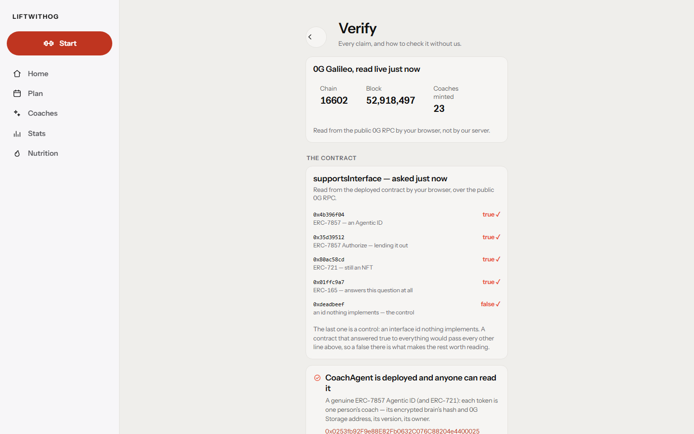

<div align="center">



<br/>

[](VERIFICATION.md#the-test-suites)
[](scripts/mutate.mjs)
[](contracts/test)
[](VERIFICATION.md#the-contract)
[](https://liftwithog.vercel.app/agent-card.json)
[](https://chainscan-galileo.0g.ai/address/0x0253fb92F9e88E82Fb0632C076C88204e4400025)
[](frontend/public/sw.js)

# The AI coach you own.

**Not a subscription. Property.** It learns from the workouts you finish. What it learns is
recorded on 0G Chain, its brain is encrypted on 0G Storage, and its advice runs sealed inside
a TEE on 0G Compute. Delete the app — your coach, its history and its rental income are still there.

### ▶ **[liftwithog.vercel.app](https://liftwithog.vercel.app)** &nbsp;·&nbsp; Prove it from your own browser: **[/#/verify](https://liftwithog.vercel.app/#/verify)**

No wallet. No seed phrase. No extension. Open it on a phone and you have a coach on 0G in thirty seconds.

</div>

---

## In sixty seconds

Every line below has a command, a transaction, or a test behind it. Not one is a promise.

| | The claim | Check it |
|---|---|---|
| 🏋️ | **A complete gym product first.** 1,324 animated exercises, plate math, warm-up ramps, an India-first nutrition engine, 11 languages, offline-first. People would use this with the chain switched off. | [Open it](https://liftwithog.vercel.app) |
| 🧠 | **The coach learns, and you can read what it learned.** Every ten sessions it re-derives itself from your real training, writes down *what changed*, re-encrypts, and `evolve()`s on chain. Version 12 is twelve sentences about you. | [`coach-runtime.js`](server/coach-runtime.js) |
| 🔑 | **Owned from a phone with no wallet and no gas — and still yours.** A device key signs; our relayer pays. The owner's address is *inside* the signed message, so the relayer can pay but cannot redirect. Coach `#4`'s owner has never held a coin. | [tx](https://chainscan-galileo.0g.ai/tx/0xc6e4c9688b4b77cb15be6dfc390d5a3b2f8b64ba205159ecd1338c27fea54cc1) · [owner](https://chainscan-galileo.0g.ai/address/0x885715F1f33aFfBaD28b21C7a048be40336da42e) |
| 🔒 | **Advice that proves where it ran, or refuses.** Every answer is TEE-attested on 0G Compute, attestation checked per response. No attested provider — the coach says so. There is no unattested fallback, and a test fails if one is added. | [`coachCompute.test.js`](server/coachCompute.test.js) |
| 🛡️ | **A contract with no owner, no pause, no upgrade, no admin key.** Nobody — including us — can freeze your coach or rewrite the rules under you. One grep proves the absence. | [below](#what-this-contract-cannot-do-to-you) |
| 💸 | **Trainers earn without holding a token.** `rent()` grants access and pays the trainer in the same transaction. `clone()` builds a lineage that pays each generation. The contract's balance is always zero — an invariant drives thousands of random calls to prove it. | [`CoachAgentFuzz.t.sol`](contracts/test/CoachAgentFuzz.t.sol) |
| 🧪 | **The numbers regenerate themselves.** 853 tests, 174 seeded faults, and a check that fails CI if any document disagrees with the suites. | `node scripts/counts.mjs --check` |

---

## The product

<div align="center">



*1,324 exercises. Every one animated, every one showing the muscles it works. Search by body part, equipment, or name; add your own.*

<br/>

<table>
  <tr>
    <td></td>
    <td></td>
    <td></td>
  </tr>
  <tr>
    <td align="center"><em>Your coach lives on the home screen — created in one tap, no wallet, then learning from every session</em></td>
    <td align="center"><em>Mid-set: 80 kg logged, set ticked, rest timer running — one hand, plate math and warm-up ramps a tap away</em></td>
    <td align="center"><em>Mifflin-St Jeor targets, hard safety bounds, IFCT foods</em></td>
  </tr>
  <tr>
    <td></td>
    <td></td>
    <td align="center" valign="middle">
      <b>Install it like an app</b><br/><br/>
      <b>Android</b> · Chrome → ⋮ → Add to Home screen<br/>
      <b>iPhone</b> · Safari → Share → Add to Home Screen<br/><br/>
      <sub>Opens with no signal. Screen stays awake mid-set. Timers beep from your pocket. Every control ≥ 44 px to a thumb — measured, not eyeballed.</sub>
    </td>
  </tr>
  <tr>
    <td align="center"><em>The market — real coaches, priced in 0G, payment atomic with access</em></td>
    <td align="center"><em><a href="https://liftwithog.vercel.app/#/verify">/verify</a> reads 0G from <b>your</b> browser, not our server</em></td>
    <td></td>
  </tr>
</table>

</div>

Built for the gym, not the desk. Every screen is designed one-handed, mid-set, with chalk on the glass.
Your coach's key is generated on the phone and never leaves it — the phone *is* the wallet — and
Settings → *Your coach's key* shows the twelve BIP-39 words, so the same account opens in any wallet
and restores on any device.

---

## The proof — read the chain, not this file

`CoachAgent` is deployed at
[`0x0253fb92F9e88E82Fb0632C076C88204e4400025`](https://chainscan-galileo.0g.ai/address/0x0253fb92F9e88E82Fb0632C076C88204e4400025),
wired to an immutable transfer verifier at
[`0xAb4553bA4C93E6e332580FA69af1E77E1d15E44B`](https://chainscan-galileo.0g.ai/address/0xAb4553bA4C93E6e332580FA69af1E77E1d15E44B).
Ask the bytecode — not us — whether it speaks ERC-7857:

```bash
$ for id in 0x4b396f04 0x35d39512 0xd79f01c7 0xdeadbeef; do
    cast call 0x0253fb92F9e88E82Fb0632C076C88204e4400025 \
      "supportsInterface(bytes4)(bool)" $id --rpc-url https://evmrpc-testnet.0g.ai
  done
true     # 0x4b396f04  ERC-7857
true     # 0x35d39512  ERC-7857 Authorize
true     # 0xd79f01c7  ERC-7857 Cloneable
false    # 0xdeadbeef  ← the control
```

**The last line is the one worth reading.** A stub that answers `true` to everything passes the
three above it and fails only that one. Without a control, three green ticks prove nothing.
The same four are read live, in your browser, on [/#/verify](https://liftwithog.vercel.app/#/verify).

**Every ERC-7857 verb has run on this contract, not just compiled:**

| | What happened | On chain |
|---|---|---|
| Gasless mint | A key generated on the spot, funded with nothing, owns coach `#4` and listed it for rent | [mint](https://chainscan-galileo.0g.ai/tx/0xc6e4c9688b4b77cb15be6dfc390d5a3b2f8b64ba205159ecd1338c27fea54cc1) · [listing](https://chainscan-galileo.0g.ai/tx/0x2f73ae2b66167c9877ef6de816e2d1b5da1e9c776b5ce9154b02ae4a9584b2a1) |
| Intelligent transfer | Brain re-encrypted to the buyer, attestor signs the hand-over, `iTransferFrom` moves it. The same attestation replayed — **refused**. Signed for somebody else — **refused**. | [transfer](https://chainscan-galileo.0g.ai/tx/0x8c60c34aa35f1685c6c7c74ee0ce7f0d875168613a9933666b8f06f3b46318ea) |
| Clone lineage | `#15 → #16 → #17`, three generations, each parent paid in full, `generationOf(17) → 3`. Not one address in the line has ever held a coin. | [gen 2](https://chainscan-galileo.0g.ai/tx/0xdda37f7b0c09d900f6224ac4c27c1dc225335b55509a2a88b790a67c03aae21c) · [gen 3](https://chainscan-galileo.0g.ai/tx/0x69b752d7d4cce130cbdf482511891e6a8513ec7876f039d1fb555aa8d86a7d0a) |
| Published rules | The literal system prompt and every nutrition bound, as a blob on 0G Storage with its hash anchored on chain. If the coach ever breaks its own rules, the rule is public and timestamped. | [anchor](https://chainscan-galileo.0g.ai/tx/0x4d82b9b127953c35d5088030509a5dbbee85b0f94571f63e84ee056569731faa) |

```bash
npm run evidence     # re-reads every one of the above from 0G, live
./verify.sh live     # the deployed contract and the deployed site — no local file counts
```

The refusals are half the proof. A transfer that always succeeds is not a check.
Stated plainly, in the verifier's own source: the attestor is a software key held by the
re-encryption service, not a hardware enclave.

---

## What this contract cannot do to you

Most of what an agent NFT promises is undone by the admin key nobody mentions. A pausable
token is one wallet away from freezing every owner; an upgradeable one can be rewritten under
them. This contract has none of that, and the absence is one command:

```bash
grep -rc "Ownable\|AccessControl\|onlyOwner\|onlyRole\|Pausable\|whenNotPaused\|UUPS\|upgradeTo\|_authorizeUpgrade\|selfdestruct\|delegatecall" contracts/src
# every file: 0
```

| Power a contract usually keeps | Here |
|---|---|
| Pause minting, transfers or use | **Does not exist** |
| Upgrade the logic under owners | **Does not exist** — no proxy, no UUPS |
| An owner or admin role | **Does not exist** |
| Swap the transfer verifier or its attestor | **Impossible** — both `immutable` |
| Hold or divert your money | **Cannot** — fees leave in the same call; no withdraw function; `invariant_ContractNeverHoldsFunds` |

The cost is real and stated: **there is no admin to rescue anybody either.** Property whose
rules can be changed under it by a third party is custody wearing a different name.
Attestations carry a signed deadline for the same reason — one that never expires is a bearer token.

---

## What nobody else on 0G has shipped

- **A working clone economy.** ERC-7857 defines `clone()`; here it pays each generation and the
  descent is on chain, uneditable — including by whoever holds the third-generation copy.
- **Attestation you can re-check yourself.** `processResponse` is a boolean from an SDK. So the
  provider's raw signature over the answer is fetched too and recovered to the address 0G's
  contract says is theirs — `ethers.recoverAddress(hashMessage(text), sig) === signer`.
  Arithmetic anyone can run. Others wired this and shipped it disabled. Ours is on.
- **A coach that knows what it must not answer.** Torn meniscus, pregnancy, a testosterone dose,
  chest pain under a bar — it hands off to a specialist *before* the model runs, not after.
  Ordinary questions are untouched, and there is a test for each side.
- **A coach another agent can hire.** `GET /api/coach/5/service` answers **HTTP 402** with price,
  payee and the call that pays it. Payment is verified against *our own* `Rented` event, not a
  forgeable token transfer. Registered as **ERC-8004 agent #382** with a public
  [agent card](https://liftwithog.vercel.app/agent-card.json).
- **A progress card a stranger can verify.** Signed by the owner, published to 0G Storage, and
  every claim on it re-derived from the chain — including what it does *not* prove: *"that a
  human under a barbell lifted the weight."*
- **A verify page that runs in the visitor's browser.** Chain id, block height, coaches minted,
  the four interface answers — read by *your* device over RPC, so nothing here depends on
  trusting our server.

---

## 0G, module by module

| Module | Where | What it does here |
|---|---|---|
| **0G Chain** | [`CoachAgent.sol`](contracts/src/CoachAgent.sol) | The coach as property: ERC-7857 + ERC-721, versioned intelligent data, expiring rentals with atomic payout, clone lineage, grants voided on sale, EIP-712 relayed mint / evolve / list |
| **0G Compute** | [`coach-runtime.js`](server/coach-runtime.js) | TEE-attested inference, attestation verified per response, **fail-closed** — no attested provider means an honest error, never a downgrade |
| **0G Storage** | [`coach-runtime.js`](server/coach-runtime.js) · [`ogVault.js`](frontend/src/lib/ogVault.js) | The coach's encrypted brain, keccak256-anchored on chain and tamper-checked on every ask; the user's AES-256-GCM vault backups, encrypted **on the device** |
| **ERC-8004** | [`register-agent.mjs`](scripts/register-agent.mjs) | Agent **#382** on 0G's Identity Registry — discoverable by any 8004 indexer while ownership stays governed by 7857 |
| **ERC-7857** | [`contracts/src/interfaces/`](contracts/src/interfaces) | Interfaces vendored **verbatim** from 0G's `agenticID-examples`, so selectors match the ecosystem byte for byte |
| **0G DA** | — | **Deliberately not used.** Nothing here is a high-throughput stream, and a decorative integration is worse than an absent one |

Diagrams, flows and the trust model: **[ARCHITECTURE.md](ARCHITECTURE.md)**.

---

## The model writes the workout. The chain decides who owns the coach.

> Everything an AI produces here is a *suggestion* about training. Ownership, rental expiry,
> price and transfer are decided by a contract with no admin — so the worst a confused,
> jailbroken or malicious model can do is give bad advice. It cannot move a coach, extend a
> subscription, or pay itself. The separation is the thing to check rather than believe.

| Guarantee | Evidence |
|---|---|
| The contract never holds anyone's money | [`invariant_ContractNeverHoldsFunds`](contracts/test/CoachAgentFuzz.t.sol) — random call sequences |
| A sale voids every rental, in constant gas | [`testFuzz_SellingClearsEveryGrant`](contracts/test/CoachAgentFuzz.t.sol) |
| Renewing never steals paid days | [`testFuzz_RenewingExtendsAndNeverShortens`](contracts/test/CoachAgentFuzz.t.sol) — fuzzed to the last second |
| The oracle cannot override the owner | [`test_TheOracleCannotOverrideTheOwner`](contracts/test/CoachAgent7857.t.sol) |
| A tampered brain is detected, not trusted | keccak256 of fetched ciphertext vs the on-chain hash, every ask |
| Nothing sensitive reaches 0G Storage in the clear | [`ogVault.test.js`](frontend/src/lib/ogVault.test.js) — *"sends ciphertext, never the training history"* |
| Wrong numbers cannot reach a diet or a bar | 174 seeded faults; `node scripts/mutate.mjs` — 169 caught, 5 proven equivalent |

**853 tests**: 585 frontend · 157 server · 111 contract (91 unit, 15 fuzz, 5 invariant).
Every number in this file is printed by `node scripts/counts.mjs`, and CI fails if a document
disagrees with the suites. **[SECURITY.md](SECURITY.md)** lists ten findings we fixed with the
test that closed each, and the risks still open. **[THREAT-MODEL.md](THREAT-MODEL.md)** says
what an attacker cannot do, and why.

---

## Who this is for, and why they stay

Serious lifters already pay for a tracker, and every one of those trackers is a rented seat:
the history lives in a company's database and the "coach" is a feature that ships when the
company does. LIFTWITHOG is the tracker first — the thing a person opens six times a week in a
basement gym with no signal — and the ownership is what makes leaving cost nothing and staying
worth something. A trainer's method becomes an asset they rent out and clone. An athlete's coach
becomes a record they carry. Nobody is asked to learn a wallet to get either.

India first, because that is where the team trains: IFCT food data, protein by reference weight,
plate math in kilograms, Hindi among the eleven languages, and safety bounds a dietician would
recognise. Everything else works anywhere.

## Four questions people ask

**Can you read my training?**
No. The coach's method is sealed on your device with ECDH + AES-256-GCM before it leaves; the
server relays ciphertext it holds no key for. Backups are encrypted on the device too. A test
fails if a workout or a number appears in what leaves the browser — [`ogVault.test.js`](frontend/src/lib/ogVault.test.js).

**What happens if LIFTWITHOG disappears?**
Your coach is a token on 0G Chain owned by a key on your phone; its brain is on 0G Storage,
anchored by hash. Any ERC-7857 reader can find it, and the twelve words in Settings open the same
account in any wallet. The tracker itself works with no server at all.

**What do you actually own?**
The ERC-7857 Agentic ID, its full version history, the encrypted brain, the rental income and
the clone lineage. Not a licence to them — the contract has no admin, no pause and no upgrade,
so there is nobody who can take them back. Including us.

**What will the coach not do?**
Answer without an attested enclave. Improvise on a torn meniscus, a pregnancy, a hormone dose or
chest pain — it hands off to a specialist before the model runs. Break the nutrition floors and
caps, which are published and anchored on chain so a broken promise would be public.

---

## Run it · verify it

```bash
git clone https://github.com/Ritik200238/LIFTWITHOG && cd LIFTWITHOG
npm install && npm --prefix frontend install
cp server/.env.example server/.env        # RELAYER_PRIVATE_KEY + COACH_ADDRESS
node server/server.js                     # API on :3000
npm --prefix frontend run dev             # app on :5173

docker compose up -d                      # or: your own box, one origin, passkeys, media local
```

```bash
./verify.sh              # suites · contracts · guards · release checks
./verify.sh live         # the deployed contract and site, over RPC — nothing local counts
npm run evidence         # every on-chain claim above, re-read from 0G
```

`live` reads nothing in this repository. "The tests pass" and "the deployed thing works" are
different claims, and this project once had the first true while the second was false. They
are never reported together again. Full list of every claim and how to check it: **[VERIFICATION.md](VERIFICATION.md)**.

---

## For judges

| | |
|---|---|
| Contract + explorer | [`0x0253…0025`](https://chainscan-galileo.0g.ai/address/0x0253fb92F9e88E82Fb0632C076C88204e4400025) · 24 coaches minted, versions climbing, rentals and clones on chain |
| Criterion-by-criterion | **[SUBMISSION.md](SUBMISSION.md)** — in order of weight, a command or transaction behind every claim, and a section naming what is not done |
| Proof of integration | `supportsInterface` answered by deployed bytecode with a control · `npm run evidence` · [/#/verify](https://liftwithog.vercel.app/#/verify) |
| Architecture · Security · Threats | [ARCHITECTURE.md](ARCHITECTURE.md) · [SECURITY.md](SECURITY.md) · [THREAT-MODEL.md](THREAT-MODEL.md) |
| Walk it with no wallet | Open the [app](https://liftwithog.vercel.app) → *Continue without account* → *Load starter plan* → *Create my coach*. Thirty seconds, no extension, and the coach is on 0G. |

<br/>

<sub>The workout-tracker core builds on the open-source <b>openGym</b> project. The 0G integration, <code>CoachAgent</code>, the coach runtime, the nutrition engine, the offline layer, the stateless server and everything above <code>1.0.0</code> in the <a href="CHANGELOG.md">changelog</a> is this project's work.</sub>

<div align="center">

**[Live app](https://liftwithog.vercel.app)** · **[Verify](https://liftwithog.vercel.app/#/verify)** · **[Architecture](ARCHITECTURE.md)** · **[Every claim, checked](VERIFICATION.md)** · **[Security](SECURITY.md)** · **[Threat model](THREAT-MODEL.md)** · **[Changelog](CHANGELOG.md)**

</div>
